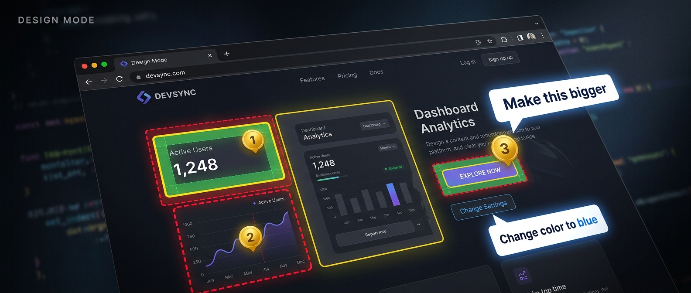

<div align="center">



### Point at your UI. Tell Claude what to change. Watch it happen.

Stop describing UI changes in chat. Click the element, type what you want, and Claude edits the source code for you — with the right file, the right selector, the right framework.

[](LICENSE)
[](https://nodejs.org)
[](https://modelcontextprotocol.io)

</div>

---

<!-- TODO: Replace with actual demo GIF -->
<!-- <div align="center">
  
  <p><em>Hover to inspect. Click to annotate. Claude applies the changes.</em></p>
</div> -->

## The Workflow

```
You:  "activate design mode on http://localhost:3000"
       → overlay appears on the page

You:   [hover over the hero heading — see margin, padding, border visualized]
       [click it, type "make this 48px bold"]
       [shift+click the CTA button, type "rounded corners, blue gradient"]
       [click the nav, type "more spacing between items"]

You:  "apply my annotations"
       → Claude finds the source files, applies all three changes, verifies with screenshots
```

No copy-pasting selectors. No digging through DevTools. No describing elements in chat.
You point, you type, Claude builds.

---

## Quick Start

**1. Enable Chrome remote debugging** — open `chrome://inspect/#remote-debugging` and tick **"Allow remote debugging for this browser instance"**

**2. Install the plugin:**
```
/plugin marketplace add harshkedia177/design-mode
/plugin install design-mode@harshkedia177-design-mode
```

**3. Go:**
```
activate design mode on http://localhost:3000
```

That's it. Three steps. [Full setup guide below](#setup-guide) if you hit issues.

---

## Why Design Mode

<table>
<tr>
<td width="50%">

### Without Design Mode
```
You: "Can you make the heading on the
     homepage larger? It's the h1 inside
     the hero section, I think it's in
     components/Hero.tsx or maybe
     pages/index.tsx, and it uses Tailwind,
     the class is text-3xl I think..."

Claude: "Which heading exactly? Can you
        share the file path?"
```
**3 messages just to identify the element.**

</td>
<td width="50%">

### With Design Mode
```
You: [click the heading, type "make bigger"]
You: "apply annotations"

Claude: ✅ Updated Hero.tsx — changed
        text-3xl to text-5xl font-bold
        [screenshot attached]
```
**One click. One message. Done.**

</td>
</tr>
</table>

---

## Features

### See what you're changing

**Box model visualization** — Hover any element to see margin (red), padding (green), and border (yellow) as colored overlays. Stop guessing why things are spaced wrong.

### Annotate in plain English

**Click-to-annotate** — Click any element, type what you want in natural language: *"make this bigger"*, *"change to blue"*, *"add drop shadow"*. Gold pins mark your annotations so you can track them.

### Claude knows exactly what you mean

**Auto-read annotations** — Every annotation includes the element's CSS selector, computed styles, a cropped screenshot, and the source file path. Claude doesn't have to guess — it gets full context automatically before every message.

### Works with your framework

**Source file mapping** — Design Mode traces each element back to its source file. React, Vue, Svelte — it finds the component, not just the DOM node.

### Batch your feedback

**Multi-select** — `Shift+Click` multiple elements, annotate each one, then apply all changes in a single pass. Redesign a whole section in one shot.

### Try before you commit

**CSS playground** — Live-tweak styles in the browser with before/after screenshots. Experiment freely, then commit only what works.

### Test every screen size

**Responsive testing** — Switch between mobile (375px), tablet (768px), and desktop (1280px) instantly. Or set any custom width.

---

## Setup Guide

### Step 1: Enable Chrome Remote Debugging

Design Mode connects to Chrome via the DevTools Protocol. You need to enable remote debugging — this is the same on **macOS, Linux, and Windows**.

> **Requires Chrome 144+** (stable since January 2026). Check your version at `chrome://settings/help`.

1. Open **Chrome** (or Chrome Canary / Chromium)
2. Go to `chrome://inspect/#remote-debugging`
3. Tick **"Allow remote debugging for this browser instance"**

That's it. You'll see a message like `Server running at: 127.0.0.1:56829` — this means it's working.

> **This works the same on all platforms.** macOS, Linux, Windows — same Chrome URL, same checkbox. No flags, no restart, no terminal commands needed.

<details>
<summary><strong>How to verify it's working</strong></summary>

Check that the `DevToolsActivePort` file was created:

**macOS:**
```bash
cat ~/Library/Application\ Support/Google/Chrome/DevToolsActivePort
```

**Linux:**
```bash
cat ~/.config/google-chrome/DevToolsActivePort
```

**Windows (PowerShell):**
```powershell
Get-Content "$env:LOCALAPPDATA\Google\Chrome\User Data\DevToolsActivePort"
```

You should see a port number on the first line (e.g., `56829`).

</details>

<details>
<summary><strong>Alternative: Launch Chrome with a flag (if the checkbox method doesn't work)</strong></summary>

Quit Chrome completely, then relaunch with the debugging flag:

**macOS:**
```bash
open -a "Google Chrome" --args --remote-debugging-port=9222
```

**Linux:**
```bash
google-chrome --remote-debugging-port=9222
```

**Windows (Command Prompt):**
```cmd
"C:\Program Files\Google\Chrome\Application\chrome.exe" --remote-debugging-port=9222
```

**Windows (PowerShell):**
```powershell
& "C:\Program Files\Google\Chrome\Application\chrome.exe" --remote-debugging-port=9222
```

</details>

<details>
<summary><strong>Supported browsers and port file locations</strong></summary>

Design Mode auto-discovers the debugging port from these locations:

| Browser | OS | Port file location |
|---------|----|--------------------|
| **Chrome** | macOS | `~/Library/Application Support/Google/Chrome/DevToolsActivePort` |
| **Chrome** | Linux | `~/.config/google-chrome/DevToolsActivePort` |
| **Chrome** | Windows | `%LOCALAPPDATA%\Google\Chrome\User Data\DevToolsActivePort` |
| **Chrome Canary** | macOS | `~/Library/Application Support/Google/Chrome Canary/DevToolsActivePort` |
| **Chromium** | Linux | `~/.config/chromium/DevToolsActivePort` |

</details>

---

### Step 2: Install Design Mode

<details open>
<summary><strong>Claude Code Plugin (recommended — full experience)</strong></summary>

In Claude Code, add the marketplace and install:
```
/plugin marketplace add harshkedia177/design-mode
/plugin install design-mode@harshkedia177-design-mode
```

Or use the interactive UI: run `/plugin` → **Discover** tab → select **design-mode** → choose your install scope. This gives you:
- All 9 MCP tools
- Auto-read annotations before every message (no manual step)
- Skills (`/design-mode`, `/annotate`, `/inspect-element`, `/playground`)
- Design assistant agent
- Auto-install dependencies on first launch

</details>

<details>
<summary><strong>Standalone MCP — Claude Code CLI</strong></summary>

```bash
claude mcp add --transport stdio design-mode -- npx -y design-mode-mcp
```

</details>

<details>
<summary><strong>Standalone MCP — Claude Desktop</strong></summary>

Add to `~/Library/Application Support/Claude/claude_desktop_config.json` (macOS) or `%APPDATA%\Claude\claude_desktop_config.json` (Windows):

```json
{
  "mcpServers": {
    "design-mode": {
      "command": "npx",
      "args": ["-y", "design-mode-mcp"]
    }
  }
}
```

</details>

<details>
<summary><strong>Standalone MCP — Cursor / Windsurf / other MCP clients</strong></summary>

Add to your `.mcp.json` or MCP settings:

```json
{
  "mcpServers": {
    "design-mode": {
      "command": "npx",
      "args": ["-y", "design-mode-mcp"]
    }
  }
}
```

</details>

<details>
<summary><strong>Local development (from source)</strong></summary>

```bash
git clone https://github.com/harshkedia177/design-mode.git
cd design-mode
npm install
claude --plugin-dir .
```

</details>

---

### Step 3: Verify Installation

1. Chrome is open with a real web page (not `chrome://newtab`)
2. Remote debugging is enabled ([Step 1](#step-1-enable-chrome-remote-debugging))
3. Run `/mcp` in Claude Code — you should see `design-mode` with 9 tools
4. Say `activate design mode` — a dark toolbar appears on the page

If something's wrong, check [Troubleshooting](#troubleshooting).

---

## Usage Guide

### Activating the Overlay

```
activate design mode
```

Or navigate to a URL and activate in one step:

```
activate design mode on http://localhost:3000
```

A toolbar appears at the top of the page. To deactivate:

```
deactivate design mode
```

### Inspecting Elements

Hover over any element to see its box model:

- **Red/pink overlay** — margin
- **Green overlay** — padding
- **Yellow outline** — border
- **Tooltip** — element tag, dimensions, classes

Works on everything — text, images, buttons, containers, SVGs.

### Annotating Elements

1. **Click** any element to select it
2. An annotation panel appears
3. Type what you want changed:
   - `"make this text bigger"`
   - `"change background to blue"`
   - `"add 16px padding"`
   - `"rounded corners, drop shadow"`
   - `"move this to the right"`
4. Press **Enter** or click **Save**
5. A **gold pin** marks the annotation

**Multi-select:** Hold `Shift` and click to annotate multiple elements. Apply all at once.

### Applying Annotations

**Plugin users:** Just type your next message. Annotations are auto-read before every message.

```
apply my annotations
```

Claude will:
1. Read all annotations with cropped screenshots
2. Find the source files (React components, Vue files, etc.)
3. Detect the styling approach (Tailwind, CSS Modules, styled-components, plain CSS)
4. Apply the changes
5. Screenshot the result

**Standalone MCP users:** Explicitly ask:

```
read my design mode annotations and apply them
```

### Managing Annotations

Click **"Notes"** in the toolbar:

- See all annotations in a list
- **Click** one to scroll to and highlight that element
- **Edit** to change the annotation text
- **Del** to remove it

### CSS Playground

Experiment with styles before committing:

```
/design-mode:playground
```

1. Select an element
2. Tweak CSS properties live
3. See before/after screenshots
4. Commit to source when happy

### Responsive Testing

```
resize viewport to mobile     # 375px
resize viewport to tablet     # 768px
resize viewport to desktop    # 1280px
resize viewport to 1440px     # custom
reset viewport                # restore default
```

---

## Keyboard Shortcuts

| Key | Action |
|-----|--------|
| `Ctrl+Shift+D` | Toggle overlay visibility |
| `Escape` | Close annotation panel |
| `Enter` | Save annotation |
| `Shift+Click` | Select multiple elements |

---

## Plugin vs Standalone

| Feature | Plugin | Standalone MCP |
|---------|--------|---------------|
| All 9 MCP tools | Yes | Yes |
| Hover/click/annotate overlay | Yes | Yes |
| Auto-read annotations every message | **Yes** | No (manual) |
| Skills (`/design-mode:*`) | **Yes** | No |
| Design assistant agent | **Yes** | No |
| Auto-install dependencies | **Yes** | No (npx handles it) |

> **Use the plugin.** The auto-read hook is the killer feature — you annotate in the browser, then just talk to Claude normally. No extra steps.

---

<details>
<summary><h2>Skills Reference</h2></summary>

Skills are available when installed as a Claude Code plugin.

| Skill | Trigger phrases | What it does |
|-------|----------------|-------------|
| `/design-mode:design-mode` | "activate design mode", "deactivate design mode" | Inject or remove the overlay |
| `/design-mode:annotate` | "apply annotations", "apply my design feedback" | Read all annotations and apply changes to source code |
| `/design-mode:inspect-element` | "inspect element", "inspect this button" | Get detailed info on any element by selector |
| `/design-mode:playground` | "css playground", "open playground" | Live CSS experimentation with before/after screenshots |

</details>

<details>
<summary><h2>MCP Tools Reference</h2></summary>

The server exposes 9 tools via the [Model Context Protocol](https://modelcontextprotocol.io):

| Tool | Parameters | Description |
|------|-----------|-------------|
| `activate` | `url?` (string) | Inject the overlay into the current page. Optionally navigate to a URL first |
| `deactivate` | — | Remove the overlay from the page |
| `read_annotations` | — | Get all annotations with element data, computed styles, and cropped screenshots |
| `read_element` | `selector` (string) | Inspect a specific element — returns styles, box model, source file info |
| `apply_style` | `selector` (string), `css` (object) | Temporarily apply inline CSS to an element (revertable) |
| `screenshot` | `selector?` (string) | Take a full-page screenshot, or a cropped screenshot of a specific element |
| `resize_viewport` | `width` (number) | Emulate a responsive viewport width |
| `reset_viewport` | — | Restore the default viewport |
| `eval_js` | `expression` (string) | Execute JavaScript in the page context and return the result |

</details>

<details>
<summary><h2>Architecture</h2></summary>

```
┌──────────────────────────────────────────────────────────┐
│                      Claude Code                         │
│                                                          │
│  ┌──────────┐    ┌────────────┐    ┌──────────────────┐  │
│  │  Skills   │───▶│ MCP Server │───▶│  Chrome (CDP)    │  │
│  └──────────┘    └────────────┘    │                  │  │
│  ┌──────────┐         │           │  Overlay Script   │  │
│  │  Hooks   │─────────┘           │  (hover/click/    │  │
│  │(auto-read)│                     │   annotate)      │  │
│  └──────────┘                     └──────────────────┘  │
│  ┌──────────┐                                           │
│  │  Agent   │  design-assistant (autonomous processor)  │
│  └──────────┘                                           │
└──────────────────────────────────────────────────────────┘
```

| Component | File | Role |
|-----------|------|------|
| **MCP Server** | `servers/index.js` | Connects to Chrome via CDP. Auto-discovers debugging port from `DevToolsActivePort` file. Exposes 9 tools. |
| **Overlay** | `scripts/overlay.js` | Self-contained IIFE injected into the page. Handles hover highlights, click-to-annotate, box model rendering, toolbar UI. Stores state in `window.__designMode`. |
| **Skills** | `skills/` | Orchestrate MCP tools for common workflows (activate, annotate, inspect, playground). |
| **Hooks** | `hooks/hooks.json` | `SessionStart` — auto-installs npm dependencies. `UserPromptSubmit` — silently reads annotations before every message. |
| **Agent** | `agents/design-assistant.md` | Autonomous agent that reads annotations, maps to source files, detects styling approach, applies changes, and verifies with screenshots. |

</details>

<details>
<summary><h2>Supported Frameworks</h2></summary>

Design Mode auto-detects the source file for annotated elements using framework-specific internals:

| Framework | Detection method | Requirements |
|-----------|-----------------|-------------|
| **React** | `__reactFiber$` + `_debugSource` | Dev mode (not production builds) |
| **Vue 2** | `__vue__` | Dev mode |
| **Vue 3** | `__vueParentComponent` | Dev mode |
| **Svelte** | `__svelte_meta` | Dev mode |
| **Custom** | `data-source` attribute | Add `data-source="path/to/file.tsx:42"` to any element |

> **Note:** Source mapping only works in development builds. Production builds strip debug metadata. Make sure your dev server is running in development mode.

</details>

---

## Troubleshooting

### Chrome connection issues

<details>
<summary><strong>"MCP server not connecting" / server not listed in /mcp</strong></summary>

1. **Check Chrome remote debugging is enabled:**
   - Open `chrome://inspect/#remote-debugging` — is "Allow remote debugging for this browser instance" checked?
   - Or verify the port file exists:
     ```bash
     # macOS
     cat ~/Library/Application\ Support/Google/Chrome/DevToolsActivePort
     # Linux
     cat ~/.config/google-chrome/DevToolsActivePort
     ```
   - If the file doesn't exist, Chrome doesn't have remote debugging enabled. See [Step 1](#step-1-enable-chrome-remote-debugging).

2. **Check MCP server status:**
   ```
   /mcp
   ```
   If `design-mode` isn't listed, restart Claude Code.

3. **Plugin not installed:**
   ```
   /plugin list
   ```
   If `design-mode` isn't listed, reinstall:
   ```
   /plugin marketplace add harshkedia177/design-mode
   /plugin install design-mode@harshkedia177-design-mode
   ```

</details>

<details>
<summary><strong>"No suitable page target found"</strong></summary>

Chrome is connected but there's no suitable page to attach to.

- Navigate to a real web page (not `chrome://newtab` or `chrome://extensions`)
- Or pass a URL: `activate design mode on http://localhost:3000`
- Make sure the page is fully loaded

</details>

### Overlay issues

<details>
<summary><strong>Overlay not appearing after activation</strong></summary>

- The page might be blocking script injection (CSP). Try on `http://localhost:3000`
- Check Chrome console for errors (`Cmd+Option+J` / `Ctrl+Shift+J`)
- Try deactivating and reactivating:
  ```
  deactivate design mode
  activate design mode
  ```

</details>

<details>
<summary><strong>Hover highlights not showing</strong></summary>

- Press `Ctrl+Shift+D` — the overlay might be hidden
- Elements with very high `z-index` can appear above the overlay

</details>

### Annotation issues

<details>
<summary><strong>Annotations not auto-reading</strong></summary>

- Auto-read only works with the **plugin** install, not standalone MCP
- Ensure Design Mode was activated via the MCP tool (not manually injected)
- The `UserPromptSubmit` hook must be active — the plugin installs this automatically

</details>

<details>
<summary><strong>Source file not detected</strong></summary>

- Your dev server must be running in **development mode** (not production)
- React: ensure `NODE_ENV=development`
- Custom: add `data-source="path/to/file.tsx:42"` to elements
- Claude falls back to searching the codebase by element content if detection fails

</details>

### Installation issues

<details>
<summary><strong>Dependencies not installing</strong></summary>

The `SessionStart` hook auto-installs. If it fails, install manually:

```bash
cd /path/to/design-mode
npm install --production
```

</details>

<details>
<summary><strong>Node.js version too old</strong></summary>

Requires Node.js 18+. Check:

```bash
node --version
```

Update via [nodejs.org](https://nodejs.org) or your package manager.

</details>

---

## License

MIT — [Harsh Kedia](https://github.com/harshkedia177)
